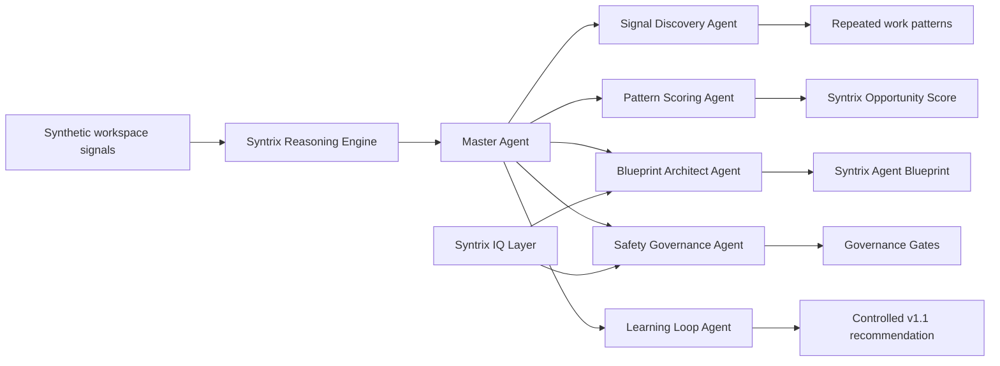

# Syntrix

**Tagline:** From scattered Copilot usage to personalized AI agents.

Syntrix is a hackathon-grade reasoning-agent product demo for companies that have adopted Copilot but still do not know which AI agents their teams actually need.

**Core thesis:** Do not ask users to design agents. Let AI discover the agents they already need.

## Problem Statement

Companies are buying AI assistants, but most users do not naturally translate their daily work patterns into safe, useful, governed agents. Their Copilot usage is scattered across prompts, drafts, summaries, meetings, status updates, and follow-ups. The agent opportunity is hidden in repeated work patterns, not in any single prompt.

## Solution Overview

Syntrix analyzes synthetic Copilot-style workspace signals, detects repeated effort, scores agent opportunities, generates governed agent blueprints, grounds recommendations in approved synthetic knowledge, and recommends controlled improvements over time.

The primary flow is:

```text
Workspace signals
-> Master Agent
-> Specialist agents
-> Reasoning trace
-> Opportunity scoring
-> Agent blueprint
-> Governance gates
-> Learning loop recommendation
```

Syntrix includes two demo surfaces:

- Cinematic FastAPI + vanilla frontend demo at `http://localhost:8000`.
- Streamlit backup demo in `app.py`.

## Why Syntrix Matters

Most agent-building workflows start by asking users to define an agent. Syntrix starts from the work itself. It helps an enterprise move from scattered AI usage to a governed agent roadmap by identifying where repeated work already exists, why an agent is justified, and what controls must exist before the agent is trusted.

## Architecture Overview



Key layers:

- `backend/`: FastAPI app, routes, services, IQ layer, and pipeline orchestration.
- `frontend/`: cinematic vanilla HTML/CSS/JS product demo.
- `agents/`: deterministic product-facing reasoning modules.
- `knowledge/`: synthetic Foundry IQ knowledge pack, Fabric-style ontology, and Work IQ-style signals.
- `synthetic_data/`: synthetic Copilot-style interaction logs and week comparison data.
- `evals/`: lightweight QA scripts, checklist, rubric, and test cases.
- `docs/`: demo script, architecture notes, setup notes, storyboard, and submission checklist.

## Multi-Agent System

Syntrix uses six product-facing agents:

- **Master Agent:** orchestrates the end-to-end reasoning loop.
- **Signal Discovery Agent:** detects repeated workflows from synthetic work signals.
- **Pattern Scoring Agent:** ranks opportunities using the Syntrix Opportunity Score.
- **Blueprint Architect Agent:** generates a structured Syntrix Agent Blueprint.
- **Safety Governance Agent:** applies approval gates, traceability, and sensitive-content controls.
- **Learning Loop Agent:** recommends controlled blueprint updates from Week 1 vs Week 3 signals.

## Syntrix Reasoning Engine

`POST /api/analyze` returns one complete reasoning response with:

- `master_agent_summary`
- `reasoning_trace`
- `opportunity_scores`
- `recommended_blueprint`
- `governance_gates`
- `learning_loop_recommendation`
- `iq_evidence`

The engine is deterministic, local, and explainable. It does not call paid APIs, use hidden model calls, or require live enterprise systems to run.

## Microsoft IQ Integration

Syntrix uses a three-part Microsoft IQ story:

- **Foundry IQ:** live verified in Azure Foundry with synthetic governance documents.
- **Fabric IQ:** represented through a local semantic ontology layer.
- **Work IQ:** represented through synthetic work-context signals.

### Live Foundry IQ Verification

Syntrix has a real Microsoft Foundry knowledge base that was created and tested in Azure Foundry using the synthetic Syntrix knowledge pack. The Foundry agent successfully answered from the uploaded synthetic governance documents.

Non-secret verification details:

| Item | Value |
| --- | --- |
| Foundry project | `syntrix-project` |
| Foundry IQ / Azure AI Search resource | `syntrix-project-srch` |
| Knowledge base | `kb-syntrix-agent-knowledge` |
| Knowledge source | `syntrix-governance-docs` |
| Resource group | `rg-mdvs2-1164` |
| Region | `Canada East` |
| Pricing tier | `Basic` |
| Data used | Synthetic markdown documents only |
| Proof screenshot | `docs/assets/foundry-iq-live-proof.png` |

No Azure credentials, API keys, connection strings, tenant secrets, or private environment files are included in the public repo.

### Foundry IQ-ready Knowledge Pack

`knowledge/foundry_iq_pack/` contains approved synthetic markdown sources used for grounding blueprint and governance recommendations:

- Agent design principles
- Enterprise AI governance
- Copilot adoption patterns
- Safe agent deployment checklist
- Blueprint quality standards
- Agent readiness rubric

### Fabric IQ Semantic Ontology

`knowledge/fabric_ontology/syntrix_ontology.json` models:

- `UserProfile`
- `WorkSignal`
- `WorkPattern`
- `AgentOpportunity`
- `AgentBlueprint`
- `GovernanceGate`
- `EvaluationCase`
- `LearningLoopUpdate`

This is a local semantic ontology layer. It does not claim live Fabric integration.

### Work IQ Synthetic Work Signals

`knowledge/work_iq_signals/work_context_signals.json` models synthetic work context:

- Frequent apps
- Meeting load
- Collaboration patterns
- Recurring tasks
- Output preferences
- Stakeholder context
- Approval sensitivity

This is a local synthetic work-signal layer. It does not use real Microsoft 365, Graph, email, customer, employee, or company data.

## Safety and Governance

Syntrix is a governed recommendation system, not an autonomous write agent.

- Human approval before external communication.
- Human approval before system changes.
- Source traceability required.
- Sensitive HR, legal, financial, employee-impacting, and customer-impacting content flagged.
- No autonomous write actions without approval.
- Learning loop recommends controlled blueprint updates; it does not silently retrain a model.

## Synthetic Data Policy

This repository uses synthetic data only.

- No real emails.
- No real customers.
- No real employees.
- No confidential documents.
- No production exports.
- No secrets or paid API keys.
- No Azure credentials required for the local demo.

Synthetic data lives in `synthetic_data/` and `knowledge/`.

## How To Run Locally

```bash
python -m venv .venv
.venv\Scripts\activate
pip install -r requirements.txt
```

Run the primary cinematic demo:

```bash
uvicorn backend.main:app --reload --port 8000
```

Open:

- Product demo: `http://localhost:8000`
- API docs: `http://localhost:8000/docs`

Run the Streamlit backup:

```bash
streamlit run app.py
```

## API Endpoints

| Endpoint | Method | Purpose |
| --- | --- | --- |
| `/` | GET | Serves the cinematic frontend |
| `/docs` | GET | FastAPI Swagger docs |
| `/api/health` | GET | Health check |
| `/api/profiles` | GET | Synthetic workspace profile list |
| `/api/interactions` | GET | Synthetic interaction records |
| `/api/analyze` | POST | Full Syntrix Reasoning Engine response |
| `/api/blueprint` | POST | Standalone blueprint generation |
| `/api/iq/status` | GET | IQ Layer status with Foundry live-verification metadata |
| `/api/iq/evidence` | GET | Grounded evidence and citations |
| `/api/iq/retrieve` | POST | Query local IQ evidence |
| `/api/evaluation/summary` | GET | Evaluation summary |

Example:

```bash
curl -X POST http://localhost:8000/api/analyze ^
  -H "Content-Type: application/json" ^
  -d "{\"profile\":\"Project Manager\"}"
```

## Demo Flow

1. Open `http://localhost:8000`.
2. Start with the thesis: "Do not ask users to design agents. Let AI discover the agents they already need."
3. Use the Workspace Signal Snapshot selector.
4. Show task frequency and Syntrix Opportunity Score.
5. Walk through the Syntrix Master Agent System and reasoning trace.
6. Show the generated Agent Blueprint.
7. Point to Governance Gates.
8. Show Microsoft IQ-ready architecture, Foundry live verification, and cited synthetic evidence.
9. Close with the Syntrix Learning Loop: controlled recommendations, not silent retraining.

## Evaluation and QA

Run:

```bash
python -m compileall backend agents evals
python evals/qa_reasoning_engine.py
python evals/qa_iq_layer.py
```

These verify that:

- Synthetic data loads.
- Reasoning pipeline runs.
- At least three opportunities are scored.
- A blueprint is generated.
- Governance gates are present.
- Learning loop recommendation is present.
- IQ knowledge pack, ontology, signals, evidence, and citations load.

Additional public evaluation materials:

- `evals/scoring_rubric.md`
- `evals/test_cases.md`
- `evals/qa_checklist.md`
- `docs/final_qa.md`

## Hackathon Judging Rubric Alignment

- **Accuracy & relevance:** recommendations are tied to repeated synthetic work patterns and transparent scores.
- **Reasoning & multi-step thinking:** Master Agent coordinates specialist agents and returns a reasoning trace.
- **Creativity & originality:** Syntrix reframes agent creation as discovery from work signals, not manual configuration.
- **User experience & presentation:** cinematic frontend tells a complete product story with charts, blueprints, governance, IQ evidence, Foundry verification, and learning loop.
- **Reliability & safety:** local deterministic pipeline, synthetic data policy, no secrets, no required paid APIs, human approval gates.
- **Community vote:** clear thesis, strong enterprise relevance, and a polished story judges can understand quickly.

## Key Public Docs

- `docs/demo_script.md`
- `docs/video_storyboard.md`
- `docs/submission_checklist.md`
- `docs/final_qa.md`
- `docs/judging_rubric_mapping.md`
- `docs/architecture_overview.md`
- `docs/foundry_iq_setup.md`
- `docs/hackathon_submission_safety.md`

## Project Structure

```text
ReasoningAgent/
|-- app.py
|-- backend/
|-- frontend/
|-- agents/
|-- synthetic_data/
|-- knowledge/
|   |-- foundry_iq_pack/
|   |-- fabric_ontology/
|   `-- work_iq_signals/
|-- diagrams/
|-- docs/
|-- evals/
|-- outputs/
|-- requirements.txt
`-- README.md
```

## Internal Product Labels

- Syntrix Reasoning Engine
- Syntrix Opportunity Score
- Syntrix Agent Blueprint
- Syntrix Continuous Improvement Loop
