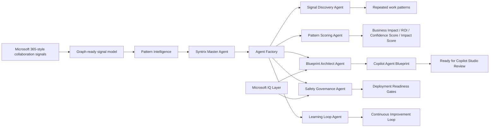

# Syntrix — Copilot Agent Architect

**Tagline:** An AI Agent Factory for Microsoft 365.

Syntrix is an **AI Agent Factory for Microsoft 365** that discovers enterprise work patterns and generates review-ready **Copilot Agent Blueprints**.

**Product thesis:** Copilot helps people work faster. Syntrix helps organizations discover which Copilot agents should exist next.

## Problem

Copilot is powerful, but organizations still do not know which Copilot agents they actually need. Work is scattered across emails, chats, meetings, documents, dashboards, approvals, and tasks. The best agent opportunities are hidden in repeated enterprise work patterns, not in a single prompt or one person's guess.

Syntrix changes the starting point. Instead of asking users to design agents from a blank page, Syntrix studies Microsoft 365-style collaboration signals and turns repeated work into governed Copilot Agent Blueprints.

## What Syntrix Does

Syntrix analyzes synthetic Microsoft 365-style collaboration signals, detects repeated work patterns, scores automation opportunities, and generates review-ready Copilot Agent Blueprints.

Each blueprint includes:

- Agent name and department.
- Business problem and detected work pattern.
- Microsoft 365 Signals Used.
- Suggested knowledge sources and suggested actions.
- System instructions.
- Guardrails and human approval points.
- Evaluation tests.
- Estimated hours saved, estimated annual ROI, Confidence Score, and Impact Score.
- Deployment Readiness and Copilot Studio review notes.
- Foundry IQ grounding and continuous improvement guidance.

The local MVP does not call Microsoft Graph, Copilot Studio, paid APIs, or live tenant systems. It uses a **Graph-ready signal model** with simulated Microsoft 365 collaboration signals.

## Product Flow

```text
Microsoft 365 Signals
-> Graph-ready signal model
-> Pattern Intelligence
-> Syntrix Master Agent
-> Agent Factory
-> Copilot Agent Blueprint
-> Ready for Copilot Studio Review
-> Continuous Improvement Loop
```

## Architecture Overview



Key layers:

- `backend/`: FastAPI app, API routes, Syntrix pipeline, IQ services, and evaluation summary.
- `frontend/`: cinematic vanilla HTML/CSS/JS product demo.
- `agents/`: deterministic product-facing reasoning modules.
- `knowledge/`: Foundry IQ knowledge pack, Fabric-style ontology, and Work IQ-style synthetic signals.
- `synthetic_data/`: synthetic Copilot-style interaction logs and Week 1 vs Week 3 comparison data.
- `docs/`: demo script, architecture notes, submission checklist, setup notes, and QA guidance.
- `evals/`: lightweight QA scripts, test cases, checklist, and scoring rubric.

## Multi-Agent Architecture

Syntrix uses six product-facing agents:

- **Master Agent:** orchestrates the Microsoft 365 signal-to-blueprint factory loop.
- **Signal Discovery Agent:** finds repeated work patterns from Microsoft 365-style synthetic signals.
- **Pattern Scoring Agent:** scores opportunities by Business Impact, ROI, Confidence Score, Impact Score, and readiness.
- **Blueprint Architect Agent:** generates a review-ready Copilot Agent Blueprint.
- **Safety Governance Agent:** applies guardrails, approval points, source traceability, and deployment readiness gates.
- **Learning Loop Agent:** compares Week 1 vs Week 3 signals and prepares controlled blueprint updates for human approval.

## Syntrix Reasoning Engine

`POST /api/analyze` returns one complete Agent Factory response:

- `master_agent_summary`
- `reasoning_trace`
- `opportunity_scores`
- `recommended_blueprint`
- `copilot_agent_blueprint`
- `governance_gates`
- `learning_loop_recommendation`
- `iq_evidence`

`recommended_blueprint` is preserved for backward compatibility. `copilot_agent_blueprint` is the enhanced review-ready artifact used by the current product experience.

The engine is deterministic, local, and explainable. It does not use hidden model calls or live enterprise systems to run.

## Microsoft Alignment

Syntrix is designed for Microsoft 365 architecture while staying honest about the MVP boundary.

- **Microsoft 365-style signals:** the demo models signals from Outlook, Teams, Calendar, SharePoint/OneDrive, and Planner using synthetic data.
- **Graph-ready signal model:** the local schema is designed so future versions could connect to Microsoft Graph with permissioned tenant data.
- **Azure AI Foundry / Foundry IQ:** the knowledge pack was live verified in Azure Foundry using synthetic governance documents.
- **Copilot Studio review-ready output:** Syntrix generates structured Copilot Agent Blueprints intended for human review before any deployment path.

### Honest Architecture Note

- Foundry IQ was live verified in Azure Foundry.
- Microsoft 365 / Graph signals are simulated for the MVP.
- Fabric IQ is represented through a semantic ontology layer.
- Work IQ is represented through Microsoft 365-style synthetic work-context signals.
- No credentials, API keys, connection strings, tenant secrets, real emails, real employees, real customers, or real tenant data are included.

## Live Foundry IQ Verification

Syntrix has a real Microsoft Foundry knowledge base that was created and tested in Azure Foundry using the synthetic Syntrix knowledge pack. The Foundry agent successfully answered from uploaded synthetic governance documents.

Non-secret verification details:

| Item | Value |
| --- | --- |
| Foundry project | `syntrix-project` |
| Foundry IQ / Azure AI Search resource | `syntrix-project-srch` |
| Knowledge base | `kb-syntrix-agent-knowledge` |
| Knowledge source | `syntrix-governance-docs` |
| Resource group | `rg-mdvs2-1164` |
| Region | `Canada East` |
| Pricing tier | `Basic` |
| Data used | Synthetic markdown documents only |
| Proof screenshot | `docs/assets/foundry-iq-live-proof.png` |

The public repository does not include Azure credentials.

## Microsoft IQ Layer

### Foundry IQ-ready Knowledge Pack

`knowledge/foundry_iq_pack/` contains approved synthetic markdown sources used for blueprint grounding and governance review:

- Agent design principles.
- Enterprise AI governance.
- Copilot adoption patterns.
- Safe agent deployment checklist.
- Blueprint quality standards.
- Agent readiness rubric.

### Fabric IQ Semantic Ontology

`knowledge/fabric_ontology/syntrix_ontology.json` models users, work signals, work patterns, agent opportunities, blueprints, governance gates, evaluation cases, and learning loop updates.

This is a local semantic ontology layer, not a claim of live Fabric IQ integration.

### Work IQ Synthetic Work Signals

`knowledge/work_iq_signals/work_context_signals.json` models Microsoft 365-style synthetic work context, including frequent apps, meeting load, collaboration patterns, recurring tasks, output preferences, stakeholder context, and approval sensitivity.

This is a synthetic work-signal layer. It does not use real Microsoft Graph, Copilot Studio, Microsoft 365 tenant data, emails, customers, employees, or company data.

## Safety and Governance

Syntrix is a governed Copilot Agent Blueprint generation system, not an autonomous write agent.

- Human approval before external communication.
- Human approval before system changes.
- Source traceability required.
- Sensitive HR, legal, financial, employee-impacting, and customer-impacting content flagged.
- No autonomous write actions without approval.
- Learning loop prepares controlled blueprint updates; it does not silently retrain a model.

## Synthetic Data Policy

This repository uses synthetic data only.

- No real emails.
- No real customers.
- No real employees.
- No confidential documents.
- No production exports.
- No secrets or paid API keys.
- No Azure credentials required for the local demo.

Synthetic data lives in `synthetic_data/` and `knowledge/`.

## How To Run Locally

```bash
python -m venv .venv
.venv\Scripts\activate
pip install -r requirements.txt
```

Run the primary cinematic demo:

```bash
uvicorn backend.main:app --reload --port 8000
```

Open:

- Product demo: `http://localhost:8000`
- API docs: `http://localhost:8000/docs`

Run the Streamlit backup:

```bash
streamlit run app.py
```

## API Endpoints

| Endpoint | Method | Purpose |
| --- | --- | --- |
| `/` | GET | Serves the cinematic frontend |
| `/docs` | GET | FastAPI Swagger docs |
| `/api/health` | GET | Health check |
| `/api/profiles` | GET | Synthetic workspace profile list |
| `/api/interactions` | GET | Synthetic interaction records |
| `/api/analyze` | POST | Full Syntrix Agent Factory reasoning response |
| `/api/blueprint` | POST | Standalone Copilot Agent Blueprint generation |
| `/api/iq/status` | GET | IQ Layer status with Foundry live-verification metadata |
| `/api/iq/evidence` | GET | Grounded evidence and citations |
| `/api/iq/retrieve` | POST | Query local IQ evidence |
| `/api/evaluation/summary` | GET | Evaluation summary |

Example:

```bash
curl -X POST http://localhost:8000/api/analyze ^
  -H "Content-Type: application/json" ^
  -d "{\"profile\":\"Project Manager\"}"
```

## Demo Flow

1. Open `http://localhost:8000`.
2. State the thesis: Copilot helps people work faster; Syntrix helps organizations discover which Copilot agents should exist next.
3. Choose a Microsoft 365 Signals workspace view.
4. Show Pattern Intelligence, task frequency, Impact Score, ROI, and Confidence Score.
5. Walk through the Syntrix Master Agent and Agent Factory handoffs.
6. Show the review-ready Copilot Agent Blueprint.
7. Point to Deployment Readiness and Copilot Studio Review Gates.
8. Show Microsoft IQ-ready architecture, Foundry live verification, and cited synthetic evidence.
9. Close with the Continuous Improvement Loop.

## Evaluation and QA

Run:

```bash
python -m compileall backend agents evals
python evals/qa_reasoning_engine.py
python evals/qa_iq_layer.py
```

These verify that:

- Synthetic data loads.
- Reasoning pipeline runs.
- At least three opportunities are scored.
- A Copilot Agent Blueprint is generated.
- Governance gates are present.
- Learning loop recommendation is present.
- IQ knowledge pack, ontology, signals, evidence, and citations load.

Additional public evaluation materials:

- `evals/scoring_rubric.md`
- `evals/test_cases.md`
- `evals/qa_checklist.md`
- `docs/final_qa.md`

## Hackathon Judging Rubric Alignment

- **Accuracy & relevance:** Copilot Agent Blueprints are tied to repeated synthetic Microsoft 365-style work patterns and transparent impact scoring.
- **Reasoning & multi-step thinking:** Master Agent coordinates specialist agents and returns a reasoning trace.
- **Creativity & originality:** Syntrix reframes agent creation as an Agent Factory that turns scattered Microsoft 365 work patterns into governed Copilot Agent Blueprints.
- **User experience & presentation:** cinematic frontend tells a complete story with Microsoft 365 Signals, Pattern Intelligence, Business Impact, ROI, Confidence Score, Copilot Agent Blueprints, governance, IQ evidence, Foundry verification, and Deployment Readiness.
- **Reliability & safety:** local deterministic pipeline, synthetic data policy, no secrets, no required paid APIs, human approval gates.
- **Community vote:** clear thesis, strong enterprise relevance, and a polished story judges can understand quickly.

## Key Public Docs

- `docs/demo_script.md`
- `docs/video_storyboard.md`
- `docs/submission_checklist.md`
- `docs/final_qa.md`
- `docs/judging_rubric_mapping.md`
- `docs/architecture_overview.md`
- `docs/foundry_iq_setup.md`
- `docs/hackathon_submission_safety.md`

## Project Structure

```text
ReasoningAgent/
|-- app.py
|-- backend/
|-- frontend/
|-- agents/
|-- synthetic_data/
|-- knowledge/
|   |-- foundry_iq_pack/
|   |-- fabric_ontology/
|   `-- work_iq_signals/
|-- diagrams/
|-- docs/
|-- evals/
|-- outputs/
|-- requirements.txt
`-- README.md
```

## Internal Product Labels

- Syntrix Reasoning Engine
- Syntrix Impact Score
- Syntrix Copilot Agent Blueprint
- Syntrix Continuous Improvement Loop
