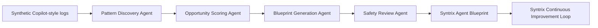

# Syntrix

**Syntrix — From scattered Copilot usage to personalized AI agents.**

Companies are buying Copilot, but most users do not know how to convert their daily work patterns into useful AI agents. Syntrix discovers the agents people already need by analyzing synthetic Copilot-style interactions, finding repeated workflows, scoring automation opportunities, and generating safe personalized agent blueprints.

> Winning thesis: do not ask users to design agents. Let AI discover the agents they already need.

## Hackathon Track

**Reasoning Agents**

Syntrix is built as a multi-agent reasoning system, not a chatbot. The first version runs locally with synthetic data only and demonstrates how an enterprise could move from scattered AI usage to governed, personalized agents.

## What the Demo Shows

- A polished Streamlit product narrative for Syntrix
- Sidebar role selector for Marketing Manager, Project Manager, and HR Business Partner
- Synthetic Copilot-style work interaction logs
- Task frequency and Syntrix Opportunity Score charts
- Multi-agent reasoning flow
- Recommended agent opportunities
- Generated Syntrix Agent Blueprint
- Safety and governance review
- Syntrix Continuous Improvement Loop comparing Week 1 vs Week 3

## Architecture



## Project Structure

```text
ReasoningAgent/
├── app.py
├── agents/
│   ├── blueprint_generator.py
│   ├── data_loader.py
│   ├── models.py
│   ├── opportunity_scorer.py
│   └── safety_reviewer.py
├── synthetic_data/
│   ├── copilot_interactions.csv
│   ├── profiles.csv
│   └── week_comparison.csv
├── diagrams/
│   ├── architecture.mmd
│   └── reasoning_flow.mmd
├── evals/
│   ├── scoring_rubric.md
│   └── test_cases.md
├── outputs/
│   └── sample_blueprint.md
└── .agents/skills/
    └── syntrix-demo.md
```

## Run Locally

```bash
python -m venv .venv
.venv\Scripts\activate
pip install -r requirements.txt
streamlit run app.py
```

No paid APIs are required. No real secrets are needed. The app uses synthetic data only.

## Microsoft IQ Alignment

Syntrix aligns to enterprise AI adoption priorities:

- **Reasoning:** analyzes recurring work patterns before recommending agents.
- **Governance:** generates guardrails, approval points, and evaluation tests.
- **Productivity:** focuses on measurable repeated workflows rather than generic chat.
- **Trust:** avoids real company data in the demo and makes assumptions visible.
- **Continuous improvement:** compares usage patterns over time to refine agent design.

## Internal Labels

- Syntrix Reasoning Engine
- Syntrix Opportunity Score
- Syntrix Agent Blueprint
- Syntrix Continuous Improvement Loop

## Safety Boundary

This repository intentionally uses synthetic interaction logs. It must not include real emails, real customers, real employees, confidential documents, or production credentials.
