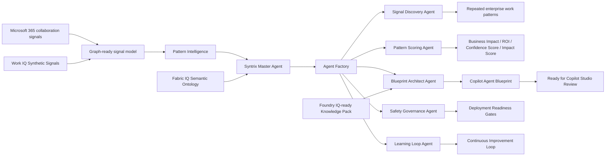

# Syntrix Architecture Overview

Syntrix — Copilot Agent Architect is an AI Agent Factory for Microsoft 365. It discovers enterprise work patterns from Microsoft 365-style collaboration signals and generates review-ready Copilot Agent Blueprints.

## Target Flow

```text
Microsoft 365 collaboration signals
-> Graph-ready signal model
-> Pattern Intelligence
-> Syntrix Master Agent
-> Agent Factory
-> Copilot Agent Blueprint
-> Copilot Studio Review
-> Continuous Improvement Loop
```

## Architecture Diagram



## FastAPI Backend

`backend/main.py` creates the FastAPI app, serves the cinematic frontend at `/`, mounts static files from `frontend/`, and exposes Swagger docs at `/docs`.

Core route modules:

- `backend/api/routes_health.py`
- `backend/api/routes_analysis.py`
- `backend/api/routes_blueprint.py`
- `backend/api/routes_iq.py`

Important endpoints:

- `POST /api/analyze`: full Syntrix Agent Factory reasoning response.
- `POST /api/blueprint`: standalone Copilot Agent Blueprint generation.
- `GET /api/iq/status`: IQ Layer status with Foundry live-verification metadata.
- `GET /api/evaluation/summary`: lightweight evaluation summary.

## Cinematic Frontend

`frontend/index.html`, `frontend/styles.css`, and `frontend/app.js` implement the local product demo. The frontend renders:

- Microsoft 365 Signals selector.
- Pattern Intelligence charts.
- Syntrix Master Agent System.
- Agent Factory reasoning trace.
- Copilot Agent Blueprint review document.
- Deployment Readiness and governance gates.
- Microsoft IQ-ready architecture and Blueprint Evidence.
- Syntrix Continuous Improvement Loop.

## Syntrix Master Agent

The Master Agent lives in `agents/reasoning_engine.py`. It coordinates the specialist agents and returns a single JSON-ready result for `/api/analyze`.

The Master Agent does not call live Microsoft Graph or Copilot Studio. In the MVP, it reasons over synthetic data through a Graph-ready signal model.

## Agent Factory

The Agent Factory includes six product-facing agents:

- **Master Agent:** coordinates the signal-to-blueprint workflow.
- **Signal Discovery Agent:** turns Microsoft 365-style collaboration signals into repeated work patterns.
- **Pattern Scoring Agent:** scores patterns by Business Impact, ROI, Confidence Score, Impact Score, and readiness.
- **Blueprint Architect Agent:** generates the review-ready Copilot Agent Blueprint.
- **Safety Governance Agent:** applies guardrails, approval points, source traceability, and Deployment Readiness gates.
- **Learning Loop Agent:** prepares controlled blueprint updates from Week 1 vs Week 3 signals.

## Copilot Agent Blueprint

The generated `copilot_agent_blueprint` is the core product artifact. It includes:

- Agent name and department.
- Business problem.
- Detected work pattern.
- Microsoft 365 Signals Used.
- Suggested knowledge sources and actions.
- System instructions.
- Guardrails.
- Estimated hours saved and estimated annual ROI.
- Confidence Score and Impact Score.
- Deployment Readiness.
- Ready for Copilot Studio Review notes.
- Foundry IQ grounding.
- Evaluation tests.
- Human approval points.
- Continuous improvement recommendation.

`recommended_blueprint` is still returned for backward compatibility.

## Microsoft IQ Layer

The Syntrix IQ Layer is implemented locally through:

- `backend/services/foundry_iq_service.py`
- `backend/services/fabric_iq_service.py`
- `backend/services/work_iq_service.py`
- `backend/services/iq_layer_service.py`

These services load local synthetic knowledge files, return status, provide evidence snippets, and attach citations to blueprint outputs.

### Foundry IQ

Foundry IQ was live verified in Azure Foundry using synthetic governance documents from `knowledge/foundry_iq_pack/`.

The public repo includes non-secret verification details and the proof screenshot at `docs/assets/foundry-iq-live-proof.png`. It does not include Azure credentials, keys, connection strings, tenant secrets, or private environment files.

### Fabric IQ

Fabric IQ is represented through `knowledge/fabric_ontology/syntrix_ontology.json`, a local semantic ontology layer for users, work signals, work patterns, agent opportunities, blueprints, governance gates, evaluation cases, and learning loop updates.

This is not a claim of live Fabric IQ integration.

### Work IQ

Work IQ is represented through Microsoft 365-style synthetic work-context signals in `knowledge/work_iq_signals/work_context_signals.json`.

This is not a claim of live Work IQ integration or real Microsoft Graph usage.

## Data Boundary

Syntrix uses synthetic data only:

- No real Microsoft 365 tenant data.
- No real emails, chats, documents, customers, employees, or confidential data.
- No secrets or paid API keys.
- No live Microsoft Graph or Copilot Studio runtime integration in the MVP.

## API Docs

Run the FastAPI app and open `http://localhost:8000/docs` to inspect and test the endpoints.
